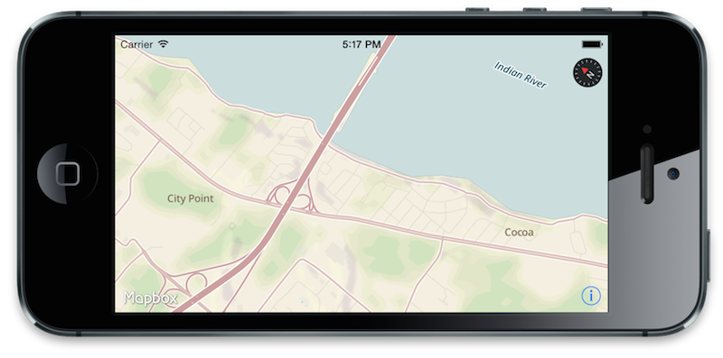

# Mapbox GL for iOS

Use or edit this project to get access to vector maps (via [Mapbox Vector Tiles](https://www.mapbox.com/blog/vector-tiles)) and dynamic OpenGL-based styling in your iOS apps by using `MGLMapView`. 



## Installation

Currently in flux. See the parent `mapbox-gl-native` project `README` for details on building this library yourself. 

Static and dynamic prebuilt binaries are coming back, as is CocoaPods support. 

## Example usage

### Objective-C

```objective-c
MGLMapView *mapView = [[MGLMapView alloc] initWithFrame:CGRectMake(0, 0, 400, 400)
                                            accessToken:@"<access token string>"];

[mapView setCenterCoordinate:CLLocationCoordinate2DMake(28.369334, -80.743779) 
                   zoomLevel:13 
                    animated:NO];

[mapView useBundledStyleNamed:@"outdoors"];

[self.view addSubview:mapView];
```

### Swift

```swift
let mapView = MGLMapView(frame: CGRect(x: 0, y: 0, width: 400, height: 400),
                         accessToken: "<access token string>")

mapView.setCenterCoordinate(CLLocationCoordinate2D(latitude: 46.049900, longitude: -122.095678),
        zoomLevel: 12,
        animated: false)

mapView.useBundledStyleNamed("outdoors")

view.addSubview(mapView)
```

## Development

If you'd like to contribute to this project, go up to [Mapbox GL native](https://github.com/mapbox/mapbox-gl-native) and clone the project. 

## Testing

Currently in flux and not functioning. 

## Requirements

 * iOS 7+
 * a sense of adventure

## Styling

See the [online style reference](https://www.mapbox.com/mapbox-gl-style-spec/) for the latest documentation. Contained within the `MapboxGL.bundle` assets are a couple of starter styles in JSON format. 

The project will eventually get a programmatic styling API as well. 

## Related Projects

 * https://github.com/mapbox/mapbox-gl-style-spec
 * https://github.com/mapbox/mapbox-gl-js
 * https://github.com/mapbox/vector-tile-spec
