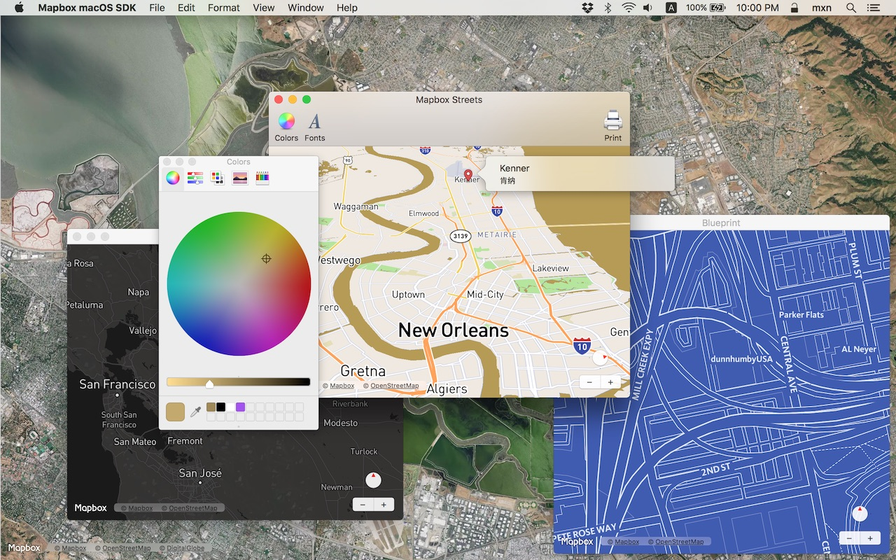

# [Mapbox Maps SDK for macOS](https://github.com/mapbox/mapbox-gl-native/tree/master/platform/macos/)

The Mapbox Maps SDK for macOS is an open-source framework for embedding interactive map views with scalable, customizable vector maps into Cocoa applications on macOS 10.10.0 and above using Objective-C, Swift, Interface Builder, or AppleScript. The SDK takes stylesheets that conform to the [Mapbox Style Specification](https://www.mapbox.com/mapbox-gl-style-spec/), applies them to vector tiles that conform to the [Mapbox Vector Tile Specification](https://www.mapbox.com/developers/vector-tiles/), and renders them using OpenGL.

For setup information, consult the README.md that comes with this documentation. For further instructions, consult the [Mapbox Maps SDK for macOS documentation](https://mapbox.github.io/mapbox-gl-native/macos/). The [Mapbox Maps SDK for iOS](https://www.mapbox.com/ios-sdk/) has [API documentation](https://www.mapbox.com/ios-sdk/api/) and [online examples](https://www.mapbox.com/ios-sdk/examples/) that apply to the macOS SDK with few differences, mostly around unimplemented features like user location tracking. A [full changelog](https://github.com/mapbox/mapbox-gl-native/blob/master/platform/macos/CHANGELOG.md) is also available.

Mapbox does not officially support the macOS SDK to the same extent as the iOS SDK; however, [bug reports and pull requests](https://github.com/mapbox/mapbox-gl-native/issues/) are certainly welcome.
